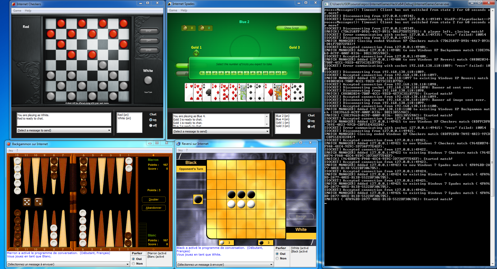

# Zone Internet Games Server

This project aims to bring back the functionality of the Internet Games, included in Windows 7, the servers for which were officially shut down on January 22nd, 2020.

Those games include:

* Internet Backgammon
* Internet Checkers
* Internet Spades

## Connecting an Internet Game to a hosted Internet Games Server

1. Ensure you have access to a hosted [Internet Games Server](#internet-games-server), either on `localhost`, your local network or via the Internet.
2. From the [latest release of this project](https://github.com/Vankata453/ZoneInternetGamesServer/releases), under "Assets", download the "Release" package for your architecture (x64 or x86).
3. Extract the downloaded package, containing the [Internet Games Server](#internet-games-server), custom client DLL and injector.

> [!NOTE]
>
> Ensure the custom client DLL (`InternetGamesClientDLL.dll`) and the injector (`DLLInjector.exe`) are in the same directory!

4. Start an Internet Game of your choice (preferably keep it on the initial info window).
5. Run `DLLInjector.exe` with a [target game argument](#command-line-arguments-dll-injector) and a dialog to type a host and port to an [Internet Games Server](#internet-games-server) should appear!

> [!WARNING]
>
> `DLLInjector.exe` is likely to be flagged by antivirus software as a threat, namely Win32/DefenseEvasion.A!ml. That is normal, since DLL Injecting is behaviour
> commonly used in malware to inject malicious code into other processes.
>
> DLL injecting, however, is required for preparing the Internet Games to connect to a custom server. Make sure you add `DLLInjector.exe` as an exception in your antivirus software!

> [!TIP]
>
> You can create a shortcut to `DLLInjector.exe` with a [target game argument](#command-line-arguments-dll-injector) for ease!

## Includes

This repository includes, or will include, the following:

### Internet Games Server

A Winsock server, which aims to make the Internet Games playable by acting as a Zone games server.
It matches players in lobbies, depending on the game being played, as well as the chosen skill level.
It can manage many matches of any of the 3 games at the same time.

Each game has custom messages, which need to be supported by the server in order for it to function properly.
The current progress on individual game support is the following:

#### Internet Backgammon

Internet Backgammon, according to my testing, is fully supported.

#### Internet Checkers

Internet Checkers, according to my testing, is fully supported.

> [!NOTE]
>
> For Internet Checkers, the server doesn't know when a game has finished with a win,
> so that leads to the drawback of causing an "Error communicating with server" message
> after a game has finished with a win (even though since the game has ended anyway, it's not really important).

#### Internet Spades

Internet Spades, according to my testing, is fully supported.

> [!NOTE]
>
> For all games, no matter supported or not, there are differences from original server behaviour:
>
> * **If an opponent leaves the game, instead of replacing them with an AI player, the server ends the game.**
>
>   The reason for this is that AI player logic has originally been developed server-side.
>   Since this server does not support game logic, they cannot be supported, hence the match is ended
>   by disconnecting all players, causing an "Error communicating with server" error on their game clients.
>
> * **Since the server does not support game logic, it will send over any valid event messages, regardless of their legitimacy.**
>
>   If a player were to modify event messages being sent to the server to try and cheat, it's up to the opponents' game clients to determine whether the actions are legitimate or not.
>   Luckily, from my testing, this local validation seems to work nicely. On invalid data, the game ends with a "Corrupted data" message.

#### Command line arguments

* `-p` (`--port`): Port to host the server on. *Default: 80*
* `-l` (`--log`): Enables socket data logging. Allows for specifying a custom folder; if not specified, the *default "InternetGamesServer_logs"* folder is used.
* `--skip-level-matching`: Allows matching players, disregarding their chosen skill level. 
* `--log-ping-messages`: Log empty received messages by sockets, which are used for pinging the server.

### Internet Games Client DLL + DLL Injector

A DLL, which is to be injected into any of the 3 games, using the DLL Injector application.

The DLL performs the following operations:

* Creates the `HKEY_CURRENT_USER\Software\Microsoft\zone.com\Zgmprxy` registry key, if it doesn't exist.
* Creates a `DisableTLS` DWORD 32-bit registry value under `HKEY_CURRENT_USER\Software\Microsoft\zone.com\Zgmprxy`, set to 1.
* Displays a dialog, where the user can enter a host and port, where an [Internet Games Server](#internet-games-server) is located, to connect to.
* Puts a hook on the [`GetAddrInfoW`](https://learn.microsoft.com/en-us/windows/win32/api/ws2tcpip/nf-ws2tcpip-getaddrinfow) function from `ws2_32.dll`, setting appropriate arguments, as well as the host and the port, specified in the dialog.

#### Command line arguments (DLL Injector)

* `-b` (`--backgammon`) *OR* `-c` (`--checkers`) *OR* `-s` (`--spades`) **[REQUIRED]**: Specifies the target game to inject the client DLL into.
* `-r` (`--repeat`): See [Using DLL Injector on multiple instances](#using-dll-injector-on-multiple-instances). *Default: 0*

## Building

To build any of the projects, open up the respective project file (.vcxproj) in Visual Studio and build from there.

### Running Multiple Instances

For information on how to run multiple instances of any of the Internet Games, [read this](docs/MultipleInstances.md).

#### Using DLL Injector on multiple instances

To use the DLL Injector on multiple instances at the same time, provide the `-r` (or `--repeat`) argument to it,
allowing to skip a select number of previously started processes of the specified Internet Game.
For example, to inject the DLL into a second instance of the same game, provide `-r 1` (or `--repeat 1`).

## Credits

* [codereversing.com](https://www.codereversing.com/archives/138) for providing some logs and tons of helpful information, regarding reverse-engineering the Internet Games.
